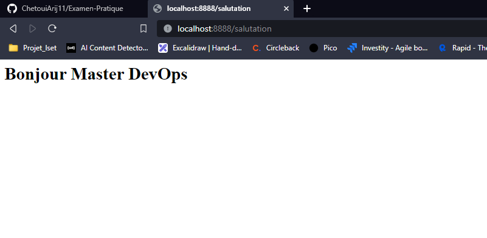
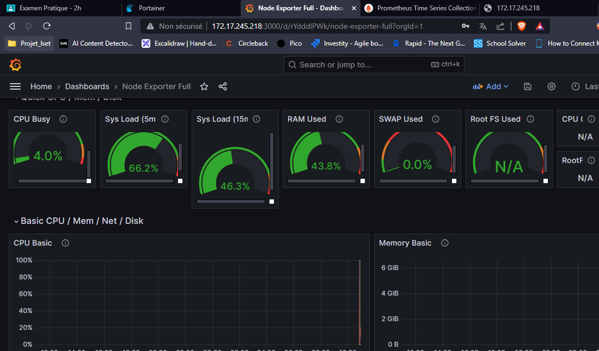
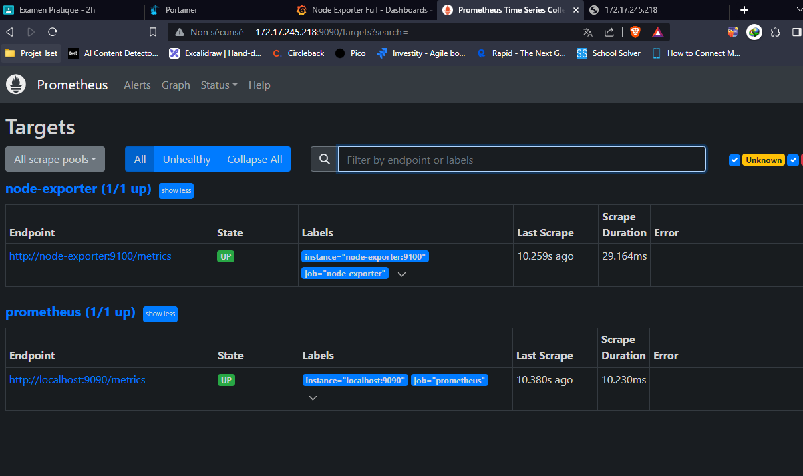

# Utilisez Vagrant pour créer une VM Ubuntu 22.04 server et utilisez Ansible pour effectuer les opérations suivantes :

-->vagrantfile:
```
Vagrant.configure("2") do |config|
  config.vm.box = "generic/ubuntu2204"
  config.vm.network "forwarded_port", guest: 80, host: 8080

  config.vm.provision "ansible" do |ansible|
    ansible.playbook = "ansible-playbook.yml"
  end
end
```

-->ansible-playbook.yml
```
---
- hosts: all
  become: yes
  tasks:
    - name: Update and upgrade the system
      apt:
        update_cache: yes
        upgrade: yes

    - name: Install dependencies
      apt:
        name:
          - apt-transport-https
          - ca-certificates
          - curl
          - gnupg
          - lsb-release
        state: present

    - name: Add Docker GPG key
      apt_key:
        url: https://download.docker.com/linux/ubuntu/gpg
        state: present

    - name: Add Docker APT repository
      apt_repository:
        repo: deb [arch=amd64] https://download.docker.com/linux/ubuntu focal stable
        state: present

    - name: Update APT package cache
      apt:
        update_cache: yes

    - name: Install Docker
      apt:
        name: docker-ce
        state: present

    - name: Add 'vagrant' user to the docker group
      user:
        name: vagrant
        groups: docker
```
--> test :


# Créez l’image docker de votre application Spring Boot (salutation) et mettez-le dans votre docker hub :


-->Dockerfile :
```
# Utilisez l'image OpenJDK officielle en tant qu'image de base
FROM openjdk:11-jre-slim

# Copiez le JAR de l'application dans l'image Docker
COPY target/test.jar /app.jar

# Exposez le port 8888 sur lequel l'application écoute
EXPOSE 8888

# Commande pour démarrer l'application lors du lancement du conteneur
CMD ["java", "-jar", "/app.jar"]


```
--> build and push image :
```
docker build -t arijchetoui1/devoirautomatisation:latest .
docker push arijchetoui1/devoirautomatisation:latest:latest

```

# Utilisez Terraform (de la VM-LAB) pour installer dans la VM créer par Vagrant un conteneur salutation qui utilise le port 9999 comme port externe:

--->main.tf:
```
provider "docker" {
  host = "tcp://192.168.121.213:2375"
}

resource "docker_container" "salutation" {
  name  = "salutation"
  image = "arijchetoui1/testautomatisation:latest"

  ports {
    internal = 8888
    external = 9999
  }
}
```
# A partir de votre machine physique, testez l’accès à votre conteneur salutation


# Monitorer le système linux de votre VM-LAB avec le dashboard grafana (id = 1860)

